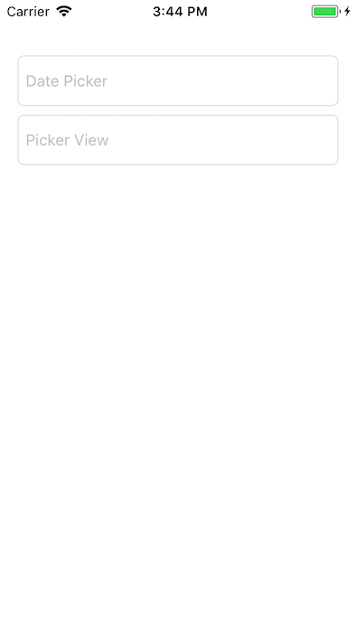

Android has Spinners to restrict users to a particular set of values in a form. Limiting the user to a set of values when entering data in a text field is not natively supported in iOS. However, UIPickerView or UIDatePicker can be configured as input view to a text field to achieve this functionality. We'll explore this idea further in this blog post.

### Initial Setup

Create a new single page app with Swift as the language in XCode. Setup the UI of the view controller in storyboard as follows:



Bootstrap the `ViewController.swift` file as below:

```swift
import UIKit

class ViewController: UIViewController {

  // MARK: Properties

  var pickerView: UIPickerView {
    get {
      let pickerView = UIPickerView()
      // TODO: Setup pickerView
      return pickerView
    }
  }

  var datePicker: UIDatePicker {
    get {
      let datePicker = UIDatePicker()
      // TODO: Setup datePicker
      return datePicker
    }
  }

  var pickerData = ["Hello", "World", "Beginning", "Swift"]

  var accessoryToolbar: UIToolbar {
    get {
      let accessoryToolbar = UIToolbar()
      // TODO: SEtup accessoryToolbar
      return accessoryToolbar
    }
  }

  // MARK: Outlets

  @IBOutlet weak var datePickerTextField: UITextField!
  @IBOutlet weak var pickerViewTextField: UITextField!

  func viewDidLoad() {
    super.viewDidLoad()

    setupUI()
  }

  func setupUI() {
    // TODO: Implement
  }

  func onDateChanged(sender: UIDatePicker) {
    // TODO: Implement
  }

  func onDoneButtonTapped(sender: UIBarButtonItem) {
    // TODO: Implement
  }
}
```

<br/>

### Date Picker as Input View

Let's start implementing the `datePicker`, and `accessoryToolbar` computed properties.

```swift
var datePicker: UIDatePicker {
  get {
    let datePicker = UIDatePicker()
    datePicker.date = Date()
    datePicker.datePickerMode = .date
    datePicker.addTarget(self,
      action: #selector(onDateChanged(sender:)),
      for: .valueChanged)
    datePicker.backgroundColor = UIColor.white
    return datePicker
  }
}

var accessoryToolbar: UIToolbar {
  get {
    let toolbarFrame = CGRect(x: 0, y: 0,
      width: view.frame.width, height: 44)
    let accessoryToolbar = UIToolbar(frame: toolbarFrame)
    let doneButton = UIBarButtonItem(barButtonSystemItem: .done,
      target: self,
      action: #selector(onDoneButtonTapped(sender:)))
    let flexibleSpace = UIBarButtonItem(barButtonSystemItem: .flexibleSpace,
      target: nil,
      action: nil)
    accessoryToolbar.items = [flexibleSpace, doneButton]
    accessoryToolbar.barTintColor = UIColor.white
    return accessoryToolbar
  }
}
```

We'll also create a `DateExtensions.swift` file in the project. We'll extend the Date class with a computed property called `mediumDateString`.

```swift
extension Date {
  var mediumDateString: String {
    let formatter = DateFormatter()
    formatter.dateStyle = .medium
    return formatter.string(from: self)
  }
}
```

With all the above in place, we can now implement the `setupUI`, `onDateChanged` and, `onDoneButtonTapped` methods in the `ViewController`.

```swift
func setupUI() {
  datePickerTextField.inputView = datePicker
  datePickerTextField.inputAccessoryView = accessoryToolbar
  // Giving the date picker text field an initial value.
  datePickerTextField.text = Date().mediumDateString
}

/// As and when the date is changed in the date picker
/// it will update the text in the datePickerTextField
@objc func onDateChanged(sender: UIDatePicker) {
  datePickerTextField.text = sender.date.mediumDateString
}

/// This removes the focus from the text field
/// and in turn hides the picker view.
@objc func onDoneButtonTapped(sender: UIBarButtonItem) {
  if datePickerTextField.isFirstResponder {
    datePickerTextField.resignFirstResponder()
  }
}
```

The resulting app will run as below:

<iframe width="560" height="315" src="https://www.youtube.com/embed/FKSkBX0rLKU?rel=0" frameborder="0" allow="autoplay; encrypted-media" allowfullscreen></iframe>

<br />
<br />

### UIPickerView as input view to UITextField

Setting up UIPickerView as an input view to UITextField is just as easy but with a little bit more boilerplate code.

First, we implement the `pickerView` computed property.

```swift
var pickerView: UIPickerView {
  get {
    let pickerView = UIPickerView()
    pickerView.dataSource = self
    pickerView.delegate = self
    pickerView.backgroundColor = UIColor.white
    return pickerView
  }
}
```

Next, we set the `inputView` property of `pickerViewTextField` to be our newly created computed property in our `setupUI` function, in addition to the already existing code.

```swift
func setupUI() {
  // ...
  pickerViewTextField.inputView = pickerView
  pickerViewTextField.inputAccessoryView = accessoryToolbar
  pickerViewTextField.text = pickerData[0]
}
```

At this point, we'll be getting errors from our compiler since our current view controller does not conform to the data source or delegate protocols of the UIPickerView. Let's address this next. We'll create extensions of our `ViewController` that conform to `UIPickerViewDataSource` and `UIPickerViewDelegate` protocols.

```swift
// MARK: - UIPickerViewDataSource

extension ViewController: UIPickerViewDataSource {
  func numberOfComponents(in pickerView: UIPickerView) -> Int {
    return 1
  }

  func pickerView(_ pickerView: UIPickerView,
    numberOfRowsInComponent component: Int) -> Int {
    return pickerData.count
  }
}

// MARK: - UIPickerViewDelegate

extension ViewController: UIPickerViewDelegate {
  func pickerView(_ pickerView: UIPickerView,
    titleForRow row: Int,
    forComponent component: Int) -> String? {
    return pickerData[row]
  }

  // Called when the scrolling stops and the row
  // in the center is set as selected.
  func pickerView(_ pickerView: UIPickerView,
    didSelectRow row: Int,
    inComponent component: Int) {
    pickerViewTextField.text = pickerData[row]
  }
}
```

Let's refresh the terminology related to UIPickerView here. Components in UIPickerView mean the number of columns to display. Since we just want the one column, we've hardcoded the return value of `func numberOfComponents(in: UIPickerView)` to be 1.

### In The End

That's all there is to using UIPickerView and UIDatePicker as input views to the UITextField. The final app should function as below:

<iframe width="560" height="315" src="https://www.youtube.com/embed/LoS92CNUOtU?rel=0" frameborder="0" allow="autoplay; encrypted-media" allowfullscreen></iframe>

<br />
<br />

I hope this tutorial has helped you in one way or the other. See you next time.
