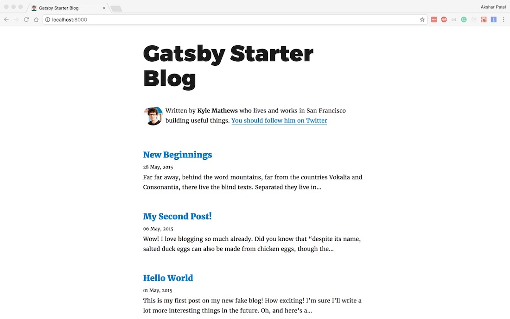

Jekyll introduced me to the world of static site generators. The developer experience of pushing updates to your GitHub repo and seeing the updates reflect on the Github pages was quite satisfying. No build step required. While over the time, I have tried several other static site generators such as Hugo and Hexo, the one that has won my heart over is [Gatsby](https://www.gatsbyjs.org/).

### Introduction

Gatsby is a static site generator which uses modern tools as such React, Webpack, and GraphQL to create a developer experience that is unmatched. It is also agnostic to your data layer. So you can pull data from your Markdown files, Wordpress website, JSON or your favorite database to create your site's static pages. It is incredibly easy to setup Gatsby. I would like to share how to host a Gatsby blog on AWS S3 and distribute it using a CloudFront distribution.

### Creating a small Gatsby Blog

Since you are reading a blog post on how to host a Gatsby site on AWS, I'm assuming that you already have a Gatsby site ready. If not, make sure you have Node.js and NPM installed and available in the path of your command line. Run the follows commands to get a demo blog to follow along.

```
// Install the Gatsby CLI
$ npm i -g gatsby-cli
// Create a starter blog
$ gatsby new gatsby-blog https://github.com/gatsbyjs/gatsby-starter-blog
// See the blog in action
$ cd gatsby-blog && gatsby develop
```

Go to ```localhost:8000``` on your favorite browser and you'll be greeted with the below screen.



<br/>

### Hosting the site on AWS S3

### Cloudfront Distribution

### Setting up a custom domain

### In the End
