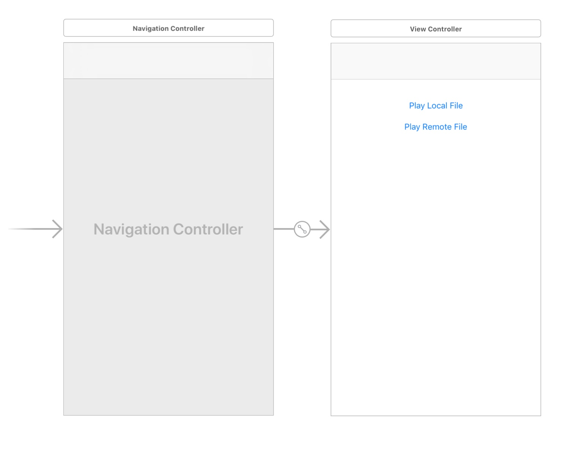

I recently had to create an audio player and recorder in an app that I was commissioned to build. The Audio Recorder+Player can record audio and, play local as well as remote files. I'll share whatever I have learned in this 3 part tutorial series on creating an Audio Player & Recorder.

In part 1 of the series, we'll see how to play local as well as remote audio in an app.

<br/>

### Setting up the environment

Let's start by creating a single page app. Add any mp3 file to the project. You can download a sample audio file from [here](https://s3.ap-south-1.amazonaws.com/aksharpatel47-static/positive_attitude.mp3).

Setup the Storyboard ViewController as follows:



Scaffold the `ViewController.swift` file as below:

```swift
import UIKit
import AVFoundation

class ViewController: UIViewController {
  // Add instance properties here

  @IBAction func playLocalFile(sender: UIButton) {
    // To Implement
  }

  @IBAction func playRemoteFile(sender: UIButton) {
    // To Implement
  }
}
```

<br/>

Make sure you register the action functions in the `ViewController.swift` file with their storyboard counterpart. We are now ready to learn how to play audio in an iOS app using Swift 4.

<br/>

### Playing a local file

Many times we want to play a local audio file in our app in response to events such as touch and swipe gestures. There are two classes in AVFoundation that can help us play an audio file in such use cases. One is AVPlayer, and the other is AVAudioPlayer. We'll first see how to play an audio file using AVAudioPlayer.

Let's create a property and function inside the `ViewController.swift` named `audioPlayer` and `playUsingAVAudioPlayer` respectively, that takes the filePath of the audio file and plays it.

```swift
var audioPlayer: AVAudioPlayer?

func playUsingAVAudioPlayer(url: URL) {
  do {
    audioPlayer = try AVAudioPlayer(contentsOf: url)
    audioPlayer?.play()
  } catch {
    print(error)
  }
}

@IBAction func playLocalFile(sender: UIButton) {
  guard let filePath = Bundle.main.path(forResource: "positive_attitude", ofType: "mp3") else {
    print("File does not exist in the bundle.")
    return
  }

  let url = URL(fileURLWithPath: filePath)

  playUsingAVPlayer(url: url)
}
```

Run the app now and you'll see that the app is playing the local audio file.

<br/>

### Playing a remote audio file

As app developers, we face the challenge of handling content hosted on remote servers daily. AVAudioPlayer, while being relatively easy to work with, does not work with audio hosted on a server. There is a workaround to download the file first and then play it using AVAudioPlayer. However, there is a better way. Enter AVPlayer.

AVPlayer is a very versatile class. It can play both local as well as remote audio content.

Let's add property `player` and `func playUsingAVPlayer` to our view controller.

```swift
var player: AVPlayer?

func playUsingAVPlayer(url: URL) {
  player = AVPlayer(url: url)
  player?.play()
}

@IBAction func playRemoteFile(sender: UIButton) {
  guard let url = URL(string: "https://s3.ap-south-1.amazonaws.com/aksharpatel47-static/positive_attitude.mp3") else {
    print("Invalid URL")
    return
  }

  playUsingAVPlayer(url)
}
```

Run the app after adding the above code. We see that when we tap the `Play from Remote File` button, the audio is being played.

As we discussed above, AVPlayer is versatile. It can play both local and remote audio. If you pass the filePath URL of the local file to the `playWithAVPlayer` function, you'll see that it can play the local file as well. So, to keep it consistent, use AVPlayer when playing audio files.

<br/>

### Playing Audio in background

What good is an audio player if it stops when the screen locks or the app goes into background?

To play the audio even when the app is in the background, we turn on `Audio, AirPlay, and Picture in Picture` in `Background Modes` from the list of project capabilities.

In addition to the above, we slightly modify the `playUsingAVPlayer` function.

```swift
func playUsingAVPlayer(url: URL) {
  do {
    try AVAudioSession.sharedInstance().setCategory(AVAudioSessionCategoryPlayback)
    player = AVPlayer(url: url)
    player?.play()
  } catch {
    print(error)
  }
}
```

<br/>

### A Common Problem

#### You have followed all the above steps and yet the audio refuses to play.

There are a lot of reasons this can happen. In my experience, this can be solved by:

- Making sure that the audio file we are trying to play is supported for playback natively in iOS.
- By setting Audio Session's category to Playback. Like we did when we wanted to play the audio in background.

<br/>

### Closing Notes

This has been the basics of playing audio using Swift 4 on iOS. There is a lot more assembly required to build a fully functioning audio player. We'll see that in the next post.
