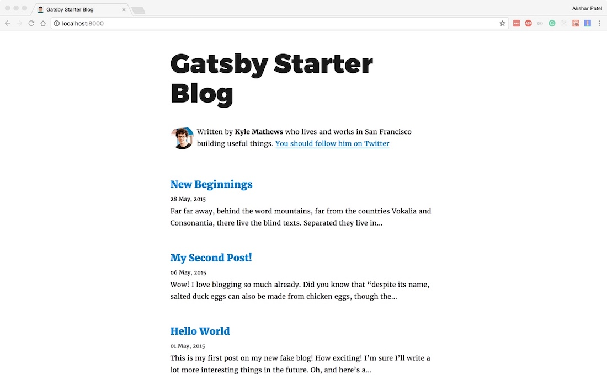
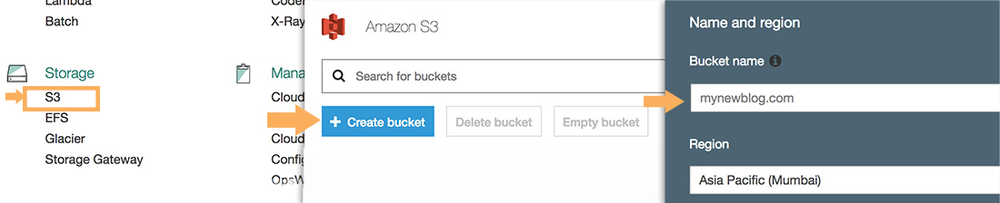
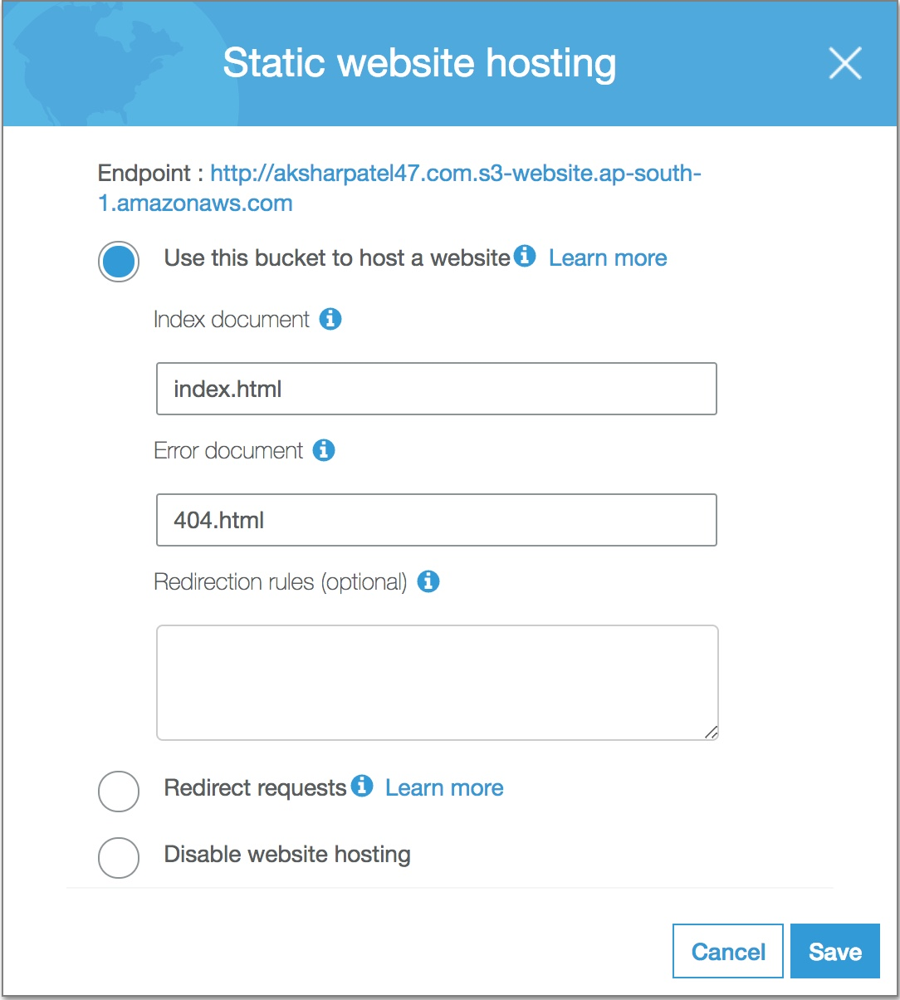

Jekyll introduced me to the world of static site generators. The developer experience of pushing updates to your GitHub repo and seeing the updates reflect on the Github pages was quite satisfying. No build step required. While over the time, I have tried several other static site generators such as Hugo and Hexo, the one that has won my heart over is [Gatsby](https://www.gatsbyjs.org/).

### Introduction

Gatsby is a static site generator which uses modern tools as such React, Webpack, and GraphQL to create a developer experience that is unmatched. It is also data-agnostic. So you can pull data from your Markdown files, Wordpress website, JSON or your favorite database to create your site's static pages. It is incredibly easy to setup Gatsby. I would like to share how to host a Gatsby blog on AWS S3 and distribute it using a CloudFront distribution.

### Creating a small Gatsby Blog

Since you are reading a blog post on how to host a Gatsby site on AWS, I'm assuming that you already have a Gatsby site ready. If not, make sure you have Node.js and NPM installed and available in the path of your command line. Run the follows commands to get a demo blog to follow along.

```
// Install the Gatsby CLI
$ npm i -g gatsby-cli
// Create a starter blog
$ gatsby new gatsby-blog https://github.com/gatsbyjs/gatsby-starter-blog
// See the blog in action
$ cd gatsby-blog && npm run develop
```

Go to ```localhost:8000``` on your favorite browser. You'll see the below screen:



### Building for Production

Running the ```gatsby develop``` command is great for making changes and adding content to your website. However, you'll need a production build when you want to upload your site to AWS S3. Run:

```
$ npm run build
```

You'll find that the production build of your site is ready in the ```public``` folder.

### Hosting on AWS S3

The next step is to upload the contents of the public folder on AWS S3. If you don't have an AWS account, create one. You'll have access to AWS free tier for the next 12 months and you'll able to host the site practically free.

#### Create an S3 Bucket

Let's say the domain name on which you're going to host the site is ```mynewblog.com```. Go to the AWS account console, select S3 and create a bucket with the same name as the domain as shown below:



You can also select the region to host the bucket. Since we'll be using CloudFront for distributing the website hosting on s3, the region

Bucket names are unique in AWS S3. If someone already has created a bucket with the name you want, you'll need to create one with a different name. Also, it is not required to name the bucket the same as the website name.

Once the bucket is created, upload all the data inside the ```public``` folder onto the bucket. Don't upload the public directory itself, but the data inside the directory. Also, when uploading, make sure to grant public read access to your data. You can do this in the Set Permissions screen during upload. Select "Grant public read access to this object(s)" in the "Manage public permissions" section.

#### Enable Static Website Hosting

On successful upload, enable static website hosting on the bucket by going into the "Properties" tab of the bucket and clicking on "Static Website Hosting." Check "Use this bucket to host a website" and enter ```index.html``` as the index document as shown below.



Take note of the endpoint in the dialog. This URL is critical, and we'll need it to create a Cloudfront distribution for our website. Visit this URL to see your content.

### Cloudfront Distribution

To create a new CloudFront distribution, select "CloudFront" from the AWS Console. If you don't have any distributions yet, you'll see a "Get Started" screen. When prompted to select the delivery method for your content, select "Get Started" from the "Web" section.

You'll now be greeted with a large form that looks like this:


Input the following values in the settings as shown below:

#### Origin Settings

There is only one origin setting you need to set:

```
Origin Domain Name: Paste the S3 Bucket Endpoint URL here.
```

Don't select any of the values that AWS suggests here.

#### Default Cache Behavior Settings

```
Viewer Protocol Policy: Redirect HTTP to HTTPs
Object Caching: Customize
Maximum TTL: 86400
Default TTL: 86400
Smooth Streaming: Yes
Compress Objects Automatically: Yes
```

Cloudfront keeps the copy of your data in their caches at edge locations. TTL determines for how long it holds the data in their cache. Which means, if we update a particular HTML or CSS file, it would not be served straight away to your users. CloudFront will wait for at the most one day (86400 seconds or the value that we set in Default TTL) before querying the S3 bucket for the new version of the object. You can change the value of TTL to fit your purpose.

Hence, if you're making a lot of changes to your site and you want to view those changes, use the s3 endpoint URL instead of the CloudFront URL, to see your changes.

#### Distribution Settings

```
Default Root Object: index.html
```

After filling up the values as per the above settings, click on "Create Distribution." It will take a few minutes to get the distribution up and running. Your CloudFront distribution domain name will be in the form ```randomstring.cloudfront.net```.

At this point, we have successfully created a CloudFront distribution to distribute our website hosted in an S3 bucket.

### Dealing with changes and cache

When you make additions to your site, run ```npm run build``` command to build the site again and upload the public folder to your S3 bucket. If you visit your S3 bucket endpoint URL, you'll see the newly built website.

However, if you visit your CloudFront domain name, you'll still be greeted with your old content. This behavior is because the CloudFront distribution cache is not yet updated and it might take up to a day before the new content can show up. If you want to remove all the content from the cache immediately, you can try "Invalidations."

#### Invalidations

To invalidate your cache, click the ID of your CloudFront distribution, and go to the invalidations tab. Create a new invalidation with the value "*" in the Object Paths text field.

Such an invalidation will clear all the cache from the edge locations.

#### Object Versions

AWS recommends an alternative to invalidations, i.e., to use object versions. For example: If we update an image file named ```image.jpeg```, we upload the updated file with the name ```image1.jpeg``` and reference it everywhere accordingly.

This strategy does not help us since all our file names are going to be the same on most of the updates.

### Conclusion

I hope this blog helps you to setup a CloudFront distribution for your static site hosted on S3. There is still the work of having our custom domain point to our newly created CloudFront distribution. We'll see that in an upcoming post. Till then, have fun experimenting with S3 and CloudFront.